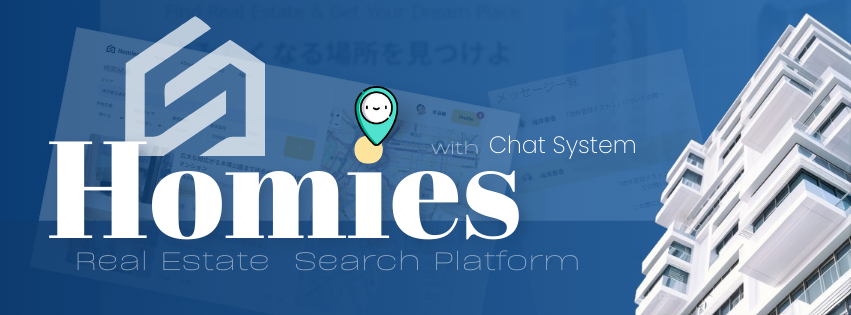
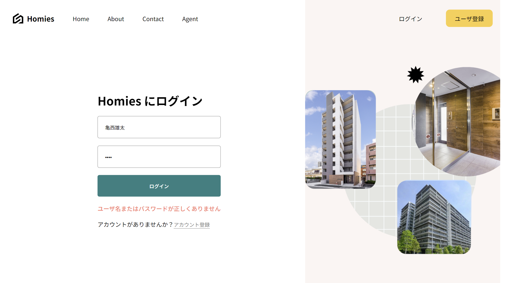
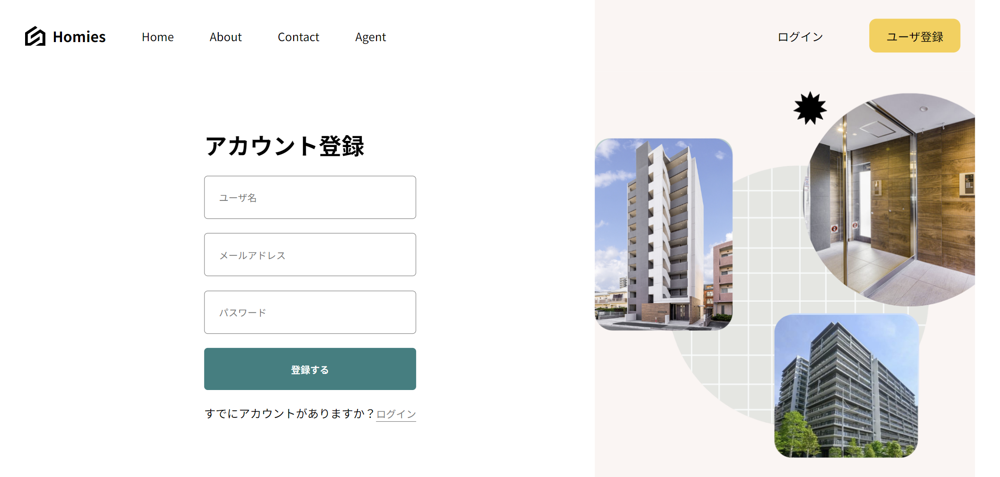
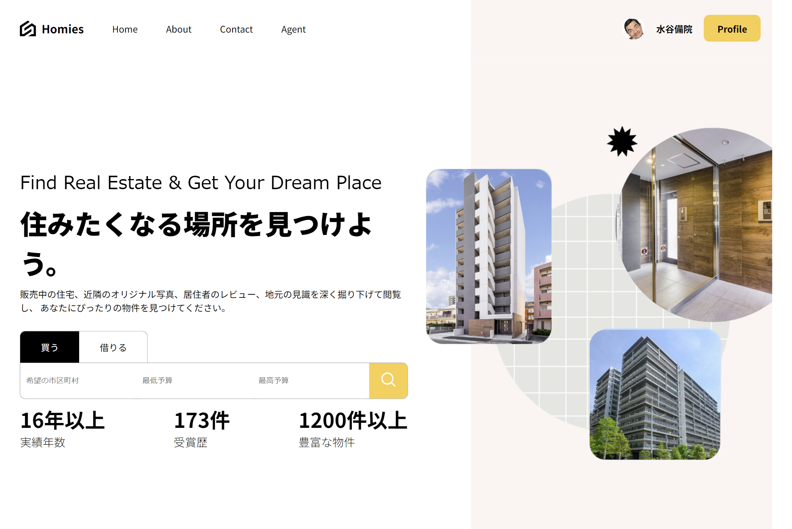
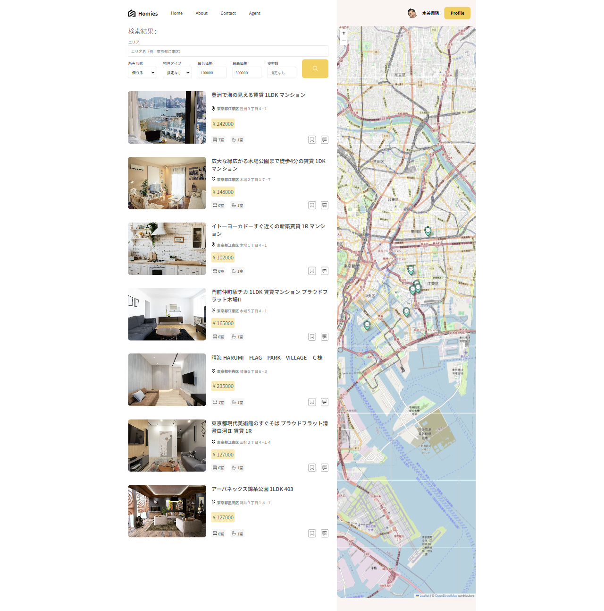
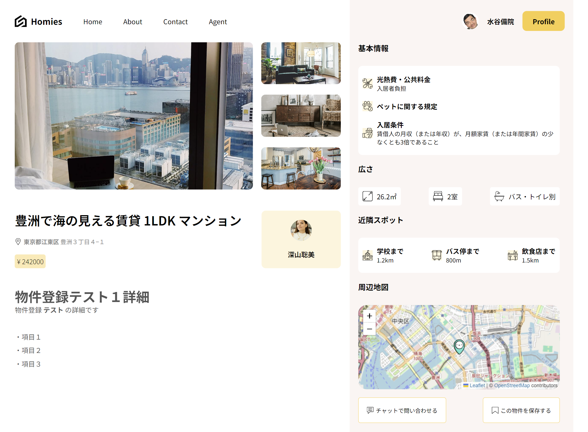
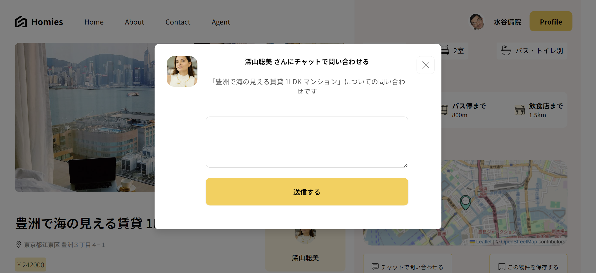
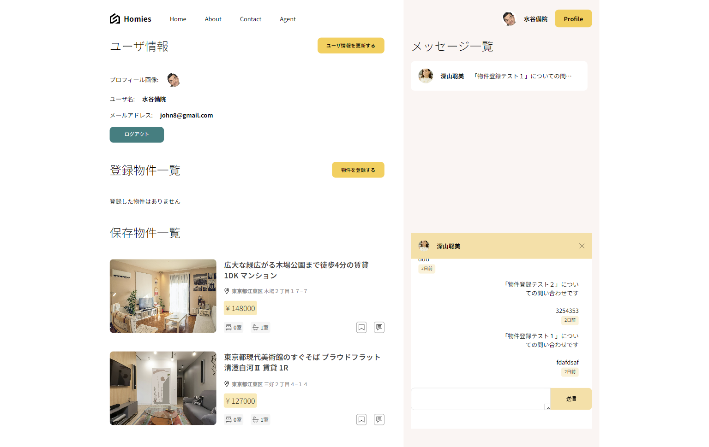
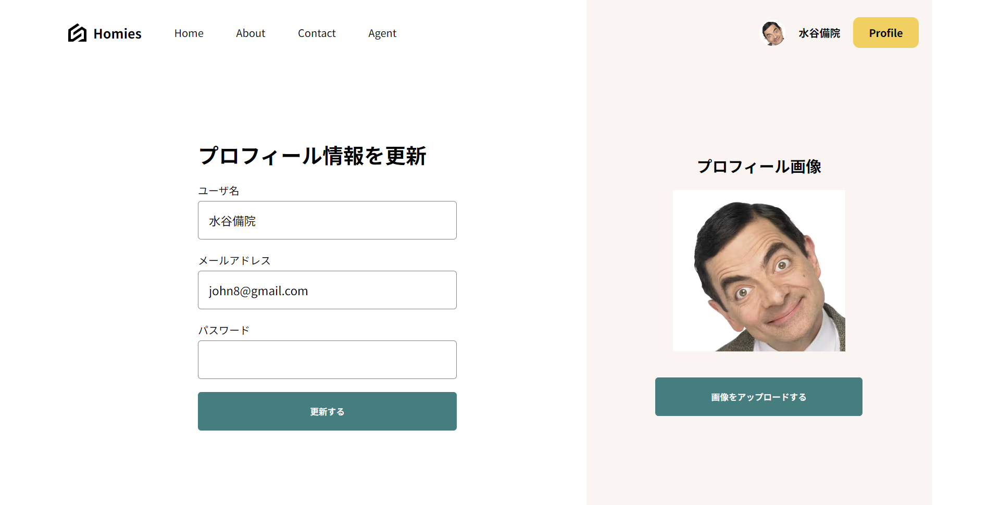
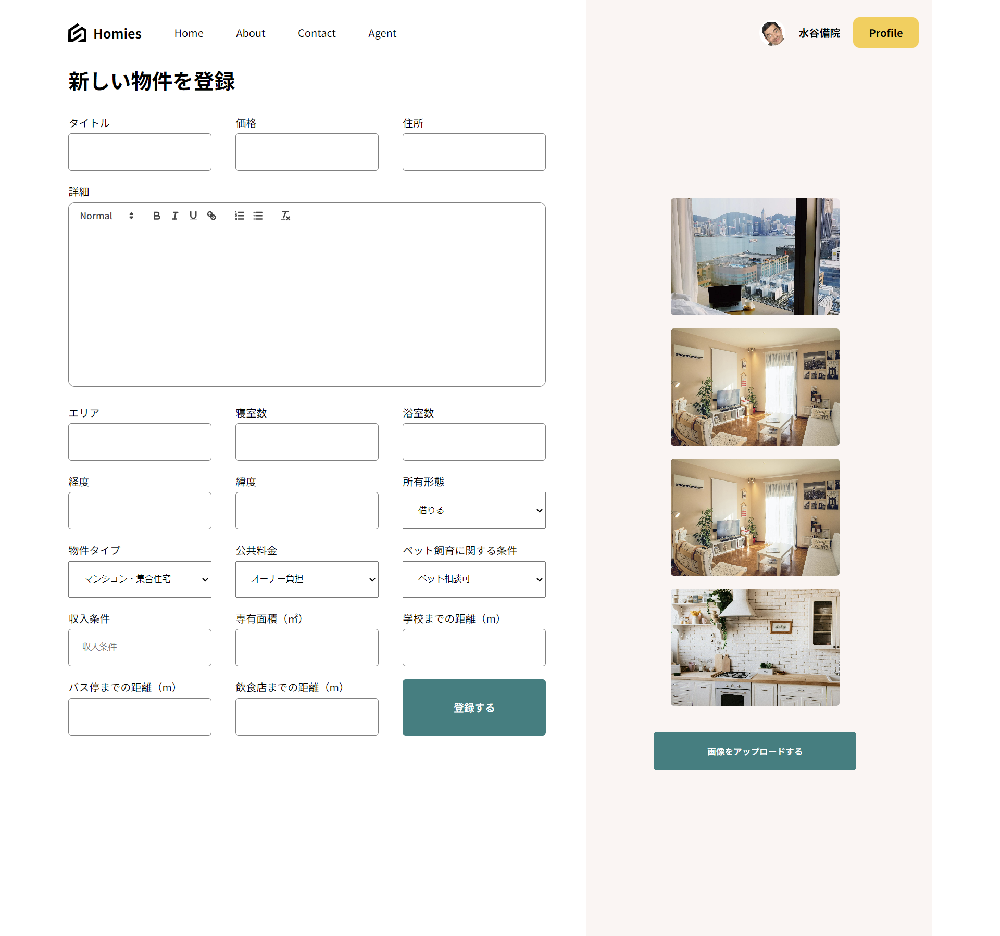

<div align="center">
  <div>
    
    
    
    
    
    
    
    
    
    
    
    
    
    
    
    
    
    
  </div>

  <h3 align="center">Real Estate Search Platform</h3>

  <div align="center">
    おうち探しのプラットフォーム
  </div>
</div>

## 📋 <a name="table">もくじ</a>

1. 🤖 [はじめに](#intro)
2. 🔗 [URL](#url)
3. 🔋 [アプリの機能](#feature)
4. 💻 [画面一覧](#screen_list)
5. 🚀 [アプリの利用サンプル](#example)
6. 🤸 [終わりに](#outro)

## <a name="intro">🤖 はじめに</a>

あなただけの特別な「おうち」を見つける、家探しのプラットフォーム、Homies を紹介します。

## <a name="url">🔗 URL</a>

Homies | Real Estate Search Platform  
https://homies-socket.onrender.com

## <a name="feature">🔋 アプリの機能</a>

### 🔐 ユーザ認証システム

メールアドレスによるユーザログインと登録システム

### 🔍 検索システム

買いたい、借りたい、エリア、予算に応じた物件を探すための検索システム

### 🧐 物件詳細確認ページ

物件の概要、基本情報、所在地、周辺地図を表示

### 🗺️ 周辺地図の表示

物件の検索結果、物件詳細ページで対象物件の位置を 📍 ピンで地図上に表示

### 💾 物件保存機能

気になる物件をブックマークすることが可能

### 🙋 問い合わせ機能

物件の紹介者に、チャットで問い合わせを行うことが可能

### 📑 物件登録ページ

紹介したい物件の情報を入力、写真をアップロード、登録することが可能

### 👤 プロフィールページ

ユーザの基本情報、登録物件一覧、お気に入り物件一覧、チャットメッセージ一覧を表示

### 🔃 プロフィール更新機能

ユーザ名、メールアドレス、パスワード、プロフィール画像の更新が可能

### 🔔 通知機能

チャットに返信があった場合に、プロファイルページのリンクボタンに通知件数をバッジで表示

### 📐 レスポンシブデザイン

あらゆるデバイスや画面サイズに対応し、機能的かつ視覚的にすぐれたデザインで表示

## <a name="screen_list">💻 画面一覧</a>

```
Homies  
　│     
　├─　ログイン関連  
　│　　　　ログインページ  
　│　　　　ユーザ登録ページ  
　│  
　├─　ホームページ  
　│  
　├─　検索結果ページ  
　│  
　├─　物件詳細確認ページ  
　│     └─　問い合わせモーダル  
　│  
　└─　プロフィールページ  
      　├─　プロフィール更新ページ   
      　├─　物件登録ページ  
        └─　チャットボックス  
```

### ログイン関連

```
ログイン関連  
　　ログインページ   
　　ユーザ登録ページ     
```

#### ログインページ 



#### ユーザ登録ページ 



### 各ページ

```
ホームページ  

検索結果ページ  

物件詳細確認ページ  
  └─　問い合わせモーダル  

プロフィールページ  
  ├─　プロフィール更新ページ   
  ├─　物件登録ページ  
  └─　チャットボックス  
```

##### ホームページ  



#### 検索結果ページ  



#### 物件詳細確認ページ 



> ##### 問い合わせモーダル
> 
> 
> 

#### プロフィールページ  



##### プロフィール更新ページ



##### プロフィール更新ページ




## <a name="example">アプリの利用サンプル</a>

##### Homies 操作デモ
<!-- ./images/homies_demo.mp4 -->
<video src="https://github.com/user-attachments/assets/8e1b9099-2c7f-4e5f-afee-aa93b12a5c37" controls="true"></video>

##### チャットデモ
<!-- ./images/chat_demo.mp4 -->
<video src="https://github.com/user-attachments/assets/702175ec-d0d2-4023-b661-aef60293928f" controls="true"></video>

## <a name="outro">🤸 おわりに</a>

物件エージェントとのチャットができる、家探しのプラットフォーム Homies を紹介しました。

機能はシンプルですが、AI の機能をさらにプラスしていくことで、運用のしやすいプラットフォームの構築が可能です。
